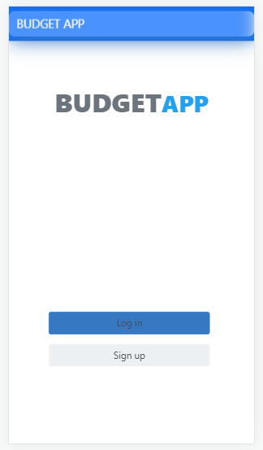

<a name="readme-top"></a>

<div align="center">

  <h3><b>Budget App README Template</b></h3>

</div>

<!-- TABLE OF CONTENTS -->

# 📗 Table of Contents

- [📖 About the Project](#about-project)
  - [🛠 Built With](#built-with)
    - [Tech Stack](#tech-stack)
    - [App Screenshots](#screenshots)
    - [Key Features](#key-features)
  - [🚀 Live Demo](#live-demo)
- [💻 Getting Started](#getting-started)
  - [Setup](#setup)
  - [Prerequisites](#prerequisites)
  - [Install](#install)
  - [Usage](#usage)
  - [Run tests](#run-tests)
  - [Deployment](#triangular_flag_on_post-deployment)
- [👥 Authors](#authors)
- [🔭 Future Features](#future-features)
- [🤝 Contributing](#contributing)
- [⭐️ Show your support](#support)
- [🙏 Acknowledgements](#acknowledgements)
- [📝 License](#license)

<!-- PROJECT DESCRIPTION -->

# 📖 [BUDGET APP] <a name="about-project"></a>

> Budget App is a mobile web application that allows you to manage your budget: you have a list of transactions associated with a category, so that you can see how much money you spend and on what.

**[BUDGET APP]** Budget App is a mobile web application that allows you to manage your budget: you have a list of transactions associated with a category, so that you can see how much money you spend and on what.

## 🛠 Built With <a name="built-with"></a>

### Tech Stack <a name="tech-stack"></a>

<details>
  <summary>Client</summary>
  <ul>
    <li><a href="https://ruby.org/">Ruby on Rails</a></li>
  </ul>
</details>

<details>
  <summary>Server</summary>
  <ul>
    <li><a href="http://localhost:3000/">localhost</a></li>
  </ul>
</details>

<details>
<summary>Database</summary>
  <ul>
    <li><a href="https://www.postgresql.org/">PostgreSQL</a></li>
  </ul>
</details>

<!-- Features -->

### Key Features <a name="key-features"></a>


- **[Login and Signup Pages: These help you to create an account and be able to luse the project]**
- **[Transactions Page to help you add a transaction]**

<p align="right">(<a href="#readme-top">back to top</a>)</p>

### App Screenshots <a name="screenshots"></a>

 


 


<p align="right">(<a href="#readme-top">back to top</a>)</p>

<!-- LIVE DEMO -->

## 🚀 Live and Video Demo <a name="live-demo"></a>

- [Live Demo Link](https://tashbudgetapp.onrender.com)

- [Video Demo Link](https://drive.google.com/file/d/1X8Z0AgUmcM-dQSERuXzzlUrxztV6nqq8/view?usp=sharing)

<p align="right">(<a href="#readme-top">back to top</a>)</p>

<!-- GETTING STARTED -->

## 💻 Getting Started <a name="getting-started"></a>

To get a local copy up and running, follow these steps.

### Prerequisites
- A text editor(preferably Visual Studio Code)

### Install
- Ruby
- Ruby on Rails
- PostgresSQL
- Rspec

### Using it Locally

- Clone the project

```
git clone https://github.com/tashisrael/Budget-app.git

cd Budget-app

```

### Setup

Install gems with:

```
bundle install
```

Setup database with:

```
rails db:create
rails db:migrate
```

### Usage

Start server with:

```
rails s
```

Visit http://localhost:3000/ in your browser.

### Run tests

Install npm with:

```
npm i
```

Install rspec with:

```
bundle install
```

and

```
rails generate rspec:install
```

run the test with:

```
rspec spec
```

<p align="right">(<a href="#readme-top">back to top</a>)</p>

<!-- AUTHORS -->

## 👥 Authors <a name="authors"></a>

👤 **Tashobya Israel**

- GitHub: [@githubhandle](https://github.com/danielmatama)
- Twitter: [@twitterhandle](https://twitter.com/danmatama)
- Linkedin: [@linkedinhandle](https://www.linkedin.com/in/danielmatama-mwebesa/l)

<p align="right">(<a href="#readme-top">back to top</a>)</p>

<!-- FUTURE FEATURES -->

## 🔭 Future Features <a name="future-features"></a>

- [ ] **[Improve the user interfaces]**

<p align="right">(<a href="#readme-top">back to top</a>)</p>

<!-- CONTRIBUTING -->

## 🤝 Contributing <a name="contributing"></a>

Contributions, issues, and feature requests are welcome!

Feel free to check the [issues page](../../issues/).

<p align="right">(<a href="#readme-top">back to top</a>)</p>

<!-- SUPPORT -->

## ⭐️ Show your support <a name="support"></a>

Give a ⭐️ if you like this project!

<p align="right">(<a href="#readme-top">back to top</a>)</p>

<!-- ACKNOWLEDGEMENTS -->

## 🙏 Acknowledgments <a name="acknowledgements"></a>

- Original design: [Gregoire Vella](https://www.behance.net/gregoirevella) on [Behance](https://www.behance.net/gallery/19759151/Snapscan-iOs-design-and-branding?tracking_source=)
- Inspiration: Microverse

<p align="right">(<a href="#readme-top">back to top</a>)</p>

<!-- LICENSE -->

## 📝 License <a name="license"></a>

This project is [MIT](./LICENSE) licensed.

<p align="right">(<a href="#readme-top">back to top</a>)</p>
